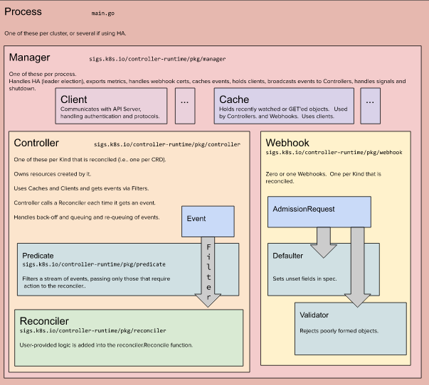

# Kubebuilder Tutorial
This is a project for learning [Kubebuilder](https://github.com/kubernetes-sigs/kubebuilder). 

This project mainly based on [Kubebuilder Book](https://book.kubebuilder.io/cronjob-tutorial/cronjob-tutorial.html) but may have additional features.

## Quick Start
### Create a Project
Create a directory, and then run the init command inside of it to initialize a new project. Follows an example.
```shell
$ kubebuilder init --domain docker.io --repo github.com/bilalcaliskan/kubebuilder-tutorial
```

**--domain** flag defines the domain of the container registry, while **--repo** defines the github repository url.

### Create an API
Run the following command to create a new API (group/version) as webapp/v1 and the new Kind(CRD) Guestbook on it:
```shell
$ kubebuilder create api --group webapp --version v1 --kind Guestbook
```

> If you press y for Create Resource [y/n] and for Create Controller [y/n] then this will create the files api/v1/guestbook_types.go where the API is defined and the controllers/guestbook_controller.go where the reconciliation business logic is implemented for this Kind(CRD).

### Test It Out
You’ll need a Kubernetes cluster to run against. You can use [KIND](https://github.com/kubernetes-sigs/kind) to get a local cluster for testing, or run against a remote cluster.

> Your controller will automatically use the current context in your kubeconfig file (i.e. whatever cluster kubectl cluster-info shows).

Install the CRDs into the cluster:
```shell
$ make install
```

Run your controller (this will run in the foreground, so switch to a new terminal if you want to leave it running):
```shell
$ make run
```

### Run It On the Cluster
Build and push your image to the location specified by IMG:
```shell
$ make docker-build docker-push IMG=<some-registry>/<project-name>:tag
```

Deploy the controller to the cluster with image specified by IMG:
```shell
$ make deploy IMG=<some-registry>/<project-name>:tag
```

### Uninstall CRDs
To delete your CRDs from the cluster:
```shell
$ make uninstall
```

### Undeploy controller
Undeploy the controller from cluster:
```shell
$ make undeploy
```

## Architectural Concept Diagram
The following diagram will help you get a better idea over the Kubebuilder concepts and architecture.

